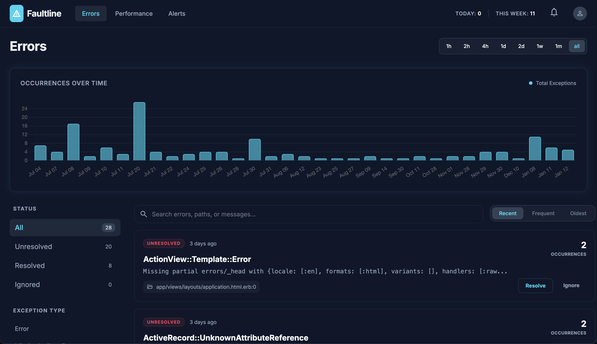
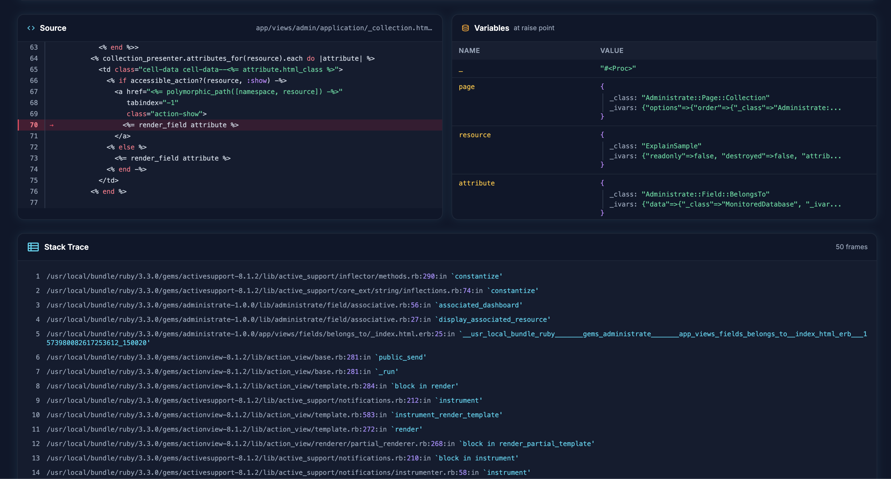

# Faultline







A self-hosted error tracking engine for Rails 8+ applications. Track errors, get notified, and resolve issues—all without external services.

## Features

- **Automatic Error Capture** - Rack middleware + Rails error reporting API
- **Smart Grouping** - Errors are grouped by fingerprint (class + message + location)
- **Debugger Inspector** - Side-by-side source code and local variables view, like a real debugger
- **Local Variables Capture** - Automatic capture of variable values at the raise point
- **Full-Text Search** - Search errors by exception class, message, or file path
- **Status Management** - Mark errors as resolved, unresolved, or ignored
- **Auto-Reopen** - Resolved errors automatically reopen when they recur
- **GitHub Integration** - Create GitHub issues directly from errors with full context
- **Rate Limiting** - Configurable cooldown prevents notification spam during error storms
- **Pluggable Notifiers** - Telegram, Slack, Email (ActionMailer or Resend), webhooks, or build your own
- **Standalone Dashboard** - Clean Tailwind UI with interactive charts and time-range zooming
- **Configurable Authentication** - Integrate with Devise, Warden, or custom auth
- **Request Context** - Capture URL, params, headers, user info, and custom data
- **Basic APM** - Track response times, throughput, and database query counts per endpoint

## Requirements

- Ruby >= 3.2
- Rails >= 8.0
- PostgreSQL, MySQL, or SQLite

## Installation

Add to your Gemfile:

```ruby
gem "faultline", git: "https://github.com/dlt/faultline.git"

# Or from RubyGems (when published)
# gem "faultline"
```

Run the installer:

```bash
bundle install
rails generate faultline:install
rails db:migrate
```

## Configuration

Edit `config/initializers/faultline.rb`:

### Authentication (Required for Production)

```ruby
Faultline.configure do |config|
  # Devise with admin role
  config.authenticate_with = lambda { |request|
    user = request.env["warden"]&.user
    user&.admin?
  }

  # Or any authenticated user
  config.authenticate_with = lambda { |request|
    request.env["warden"]&.authenticated?
  }
end
```

### GitHub Integration

Create GitHub issues directly from the error dashboard with full context including stack traces, local variables, and source code snippets.

```ruby
# Store in credentials: rails credentials:edit
# faultline:
#   github:
#     token: "ghp_xxxxx"

config.github_repo = "your-org/your-repo"
config.github_token = Rails.application.credentials.dig(:faultline, :github, :token)
config.github_labels = ["bug", "faultline"]  # default labels for created issues
```

### Notifications (Optional)

Notifications are optional. Faultline will track all errors and display them in the dashboard regardless of whether any notifiers are configured. Add notifiers only if you want to be alerted when errors occur.

#### Resend (Email)

```ruby
# Store in credentials: rails credentials:edit
# faultline:
#   resend:
#     api_key: "re_xxxxx"

config.add_notifier(
  Faultline::Notifiers::Resend.new(
    api_key: Rails.application.credentials.dig(:faultline, :resend, :api_key),
    from: "errors@yourdomain.com",
    to: "team@example.com"  # or array: ["dev@example.com", "ops@example.com"]
  )
)
```

#### Email (ActionMailer)

Use your app's existing mail configuration (SMTP, SendGrid, Postmark, Mailgun, etc.) without any external API:

```ruby
config.add_notifier(
  Faultline::Notifiers::Email.new(
    to: ["team@example.com", "oncall@example.com"],
    from: "errors@yourdomain.com"  # optional, defaults to ActionMailer default
  )
)
```

Emails are sent asynchronously via `deliver_later`, so Active Job must be configured. The email includes:
- Exception class and message
- Occurrence count and timestamps
- File location and stack trace
- User and request info (if available)

#### Telegram

```ruby
# Store in credentials: rails credentials:edit
# faultline:
#   telegram:
#     bot_token: "your-bot-token"
#     chat_id: "your-chat-id"

config.add_notifier(
  Faultline::Notifiers::Telegram.new(
    bot_token: Rails.application.credentials.dig(:faultline, :telegram, :bot_token),
    chat_id: Rails.application.credentials.dig(:faultline, :telegram, :chat_id)
  )
)
```

#### Slack

```ruby
config.add_notifier(
  Faultline::Notifiers::Slack.new(
    webhook_url: Rails.application.credentials.dig(:faultline, :slack, :webhook_url),
    channel: "#errors",
    username: "Faultline"
  )
)
```

#### Custom Webhook

```ruby
config.add_notifier(
  Faultline::Notifiers::Webhook.new(
    url: "https://your-service.com/errors",
    method: :post,
    headers: { "Authorization" => "Bearer #{ENV['WEBHOOK_TOKEN']}" }
  )
)
```

### Rate Limiting

Prevent notification spam during error storms:

```ruby
config.notification_cooldown = 5.minutes  # default, nil to disable
```

### Notification Rules

```ruby
config.notification_rules = {
  on_first_occurrence: true,           # New error types
  on_reopen: true,                     # Resolved errors that recur
  on_threshold: [10, 50, 100, 500],    # At these occurrence counts
  critical_exceptions: [               # Always notify for these
    "Stripe::APIError",
    "ActiveRecord::StatementInvalid"
  ],
  notify_in_environments: ["production"]
}
```

### Rails Error Reporting API

Optionally subscribe to Rails' error reporting API to capture errors from background jobs and explicit `Rails.error` calls:

```ruby
config.register_error_subscriber = true
```

This captures errors reported via:
- `Rails.error.handle { ... }` - handled errors (swallowed)
- `Rails.error.record { ... }` - errors re-raised after reporting
- `Rails.error.report(exception)` - manual reporting

The middleware captures unhandled exceptions with local variable capture. The error subscriber captures everything else. Both can be enabled together.

### Error Filtering

```ruby
# Exceptions to ignore
config.ignored_exceptions = [
  "ActiveRecord::RecordNotFound",
  "ActionController::RoutingError"
]

# Bots/crawlers to ignore
config.ignored_user_agents = [/bot/i, /crawler/i, /Googlebot/i]

# Paths to ignore
config.middleware_ignore_paths = ["/assets", "/health"]
```

### Custom Context

Add custom data to every error occurrence. The lambda receives the request and Rack env, and should return a hash:

```ruby
config.custom_context = lambda { |request, env|
  controller = env["action_controller.instance"]
  {
    account_id: controller&.current_account&.id,
    tenant: request.subdomain,
    feature_flags: controller&.enabled_features
  }
}
```

This data is stored with each occurrence and displayed in the dashboard under "Custom Context".

## Usage

### Dashboard

Visit `/faultline` to access the error dashboard.

### Manual Tracking

```ruby
begin
  risky_operation
rescue => e
  Faultline.track(e, {
    request: request,
    user: current_user,
    custom_data: { order_id: @order.id }
  })
  raise
end
```

### Local Variables Capture

Faultline automatically captures local variables at the point where exceptions are raised. This helps you debug errors without needing to reproduce them.

Variables are:
- **Automatically captured** via `TracePoint` when exceptions are raised
- **Filtered** for sensitive data (passwords, tokens, API keys, etc.)
- **Serialized safely** with depth limits and circular reference handling
- **Displayed** in the occurrence detail page

No configuration needed—it works out of the box.

### Callbacks

```ruby
# Skip certain errors
config.before_track = lambda { |exception, context|
  return false if exception.message.include?("Timeout")
  true
}

# Post-tracking integration
config.after_track = lambda { |error_group, occurrence|
  Analytics.track("error", { type: error_group.exception_class })
}
```

### Custom Fingerprinting

```ruby
# Group errors by custom criteria
config.custom_fingerprint = lambda { |exception, context|
  { extra_components: [context.dig(:custom_data, :tenant_id)] }
}
```

## Building Custom Notifiers

```ruby
class MyNotifier < Faultline::Notifiers::Base
  def initialize(api_key:)
    @api_key = api_key
  end

  def call(error_group, error_occurrence)
    data = format_message(error_group, error_occurrence)
    # Send to your service
    MyService.notify(data, api_key: @api_key)
  end

  # Optional: control when to notify
  def should_notify?(error_group, error_occurrence)
    error_group.occurrences_count < 100  # Stop after 100
  end
end

# Usage
config.add_notifier(MyNotifier.new(api_key: "..."))
```

## Database Tables

The engine creates three tables for error tracking:

- `faultline_error_groups` - Grouped errors by fingerprint
- `faultline_error_occurrences` - Individual error instances
- `faultline_error_contexts` - Custom key-value context data

And one table for APM (if enabled):

- `faultline_request_traces` - Individual request performance data

## Data Retention

Configure automatic cleanup:

```ruby
config.retention_days = 90  # nil = keep forever
```

Set up a scheduled job to clean old data:

```ruby
# In a cron job or Sidekiq scheduler
Faultline::ErrorOccurrence
  .where("created_at < ?", 90.days.ago)
  .in_batches
  .delete_all
```

## APM (Application Performance Monitoring)

Faultline includes basic APM to track request performance alongside your errors. It's lightweight, automatic, and requires no code changes.

### What It Tracks

| Metric | Description |
|--------|-------------|
| Response time | Total request duration (ms) |
| Database time | Time spent in ActiveRecord queries (ms) |
| View time | Time spent rendering views (ms) |
| Query count | Number of SQL queries per request |
| Status codes | HTTP response status (200, 500, etc.) |
| Throughput | Requests per minute/hour |

### How It Works

APM hooks into Rails' built-in `ActiveSupport::Notifications`:

```
Your Rails App (no changes needed)
         │
         ▼
Rails fires "process_action.action_controller" after each request
Rails fires "sql.active_record" for each SQL query
         │
         ▼
Faultline::Apm::Collector listens and stores metrics
         │
         ▼
Dashboard at /faultline/performance
```

No manual instrumentation required—Rails already emits these events for every request.

### Enabling APM

APM is **opt-in** and disabled by default:

```ruby
# config/initializers/faultline.rb
Faultline.configure do |config|
  config.enable_apm = true
end
```

Then run migrations (if you haven't already):

```bash
rails db:migrate
```

Visit `/faultline/performance` to see the dashboard.

### Configuration Options

```ruby
Faultline.configure do |config|
  # Enable APM (default: false)
  config.enable_apm = true

  # Sample rate: 1.0 = 100%, 0.1 = 10% (default: 1.0)
  # Use sampling for high-traffic apps to reduce storage/overhead
  config.apm_sample_rate = 1.0

  # Paths to ignore (default: falls back to middleware_ignore_paths)
  # Faultline's own routes are always ignored
  config.apm_ignore_paths = ["/health", "/assets", "/up"]

  # Data retention in days (default: 30)
  config.apm_retention_days = 30
end
```

### Dashboard Features

**Index page** (`/faultline/performance`):
- Summary stats: total requests, avg response time, p95, error rate
- Response time chart (avg/min/max over time)
- Throughput chart (requests per time bucket)
- Slowest endpoints table with avg, p95, request count, error rate
- Time period selector: 1h, 6h, 24h, 7d, 30d

**Endpoint detail page** (`/faultline/performance/UsersController%23show`):
- Stats for a single endpoint
- Response time chart for that endpoint
- Individual request traces (paginated, sorted by duration)

### Data Cleanup

APM data is cleaned up separately from error data:

```bash
# Run manually
rails faultline:apm:cleanup

# Or schedule it (cron, Sidekiq, etc.)
Faultline::RequestTrace.cleanup!  # Uses apm_retention_days
Faultline::RequestTrace.cleanup!(before: 7.days.ago)  # Custom
```

### Performance Overhead

| Traffic | Sample Rate | Overhead | Recommendation |
|---------|-------------|----------|----------------|
| Low (<10 req/sec) | 1.0 | ~1-5ms/request | Use 100% |
| Medium (<100 req/sec) | 1.0 | ~1-5ms/request | Use 100% |
| High (<1000 req/sec) | 0.5 | ~1-5ms/request | Use 50% |
| Very high (1000+ req/sec) | 0.1 | ~1-5ms/request | Use 10% |

The overhead is:
- **~0.01ms per SQL query** for counting
- **~1-5ms per request** for the database INSERT (after response is sent)

The INSERT happens *after* Rails sends the response, so users don't wait for it.

### Caveats & Limitations

1. **Not a full APM replacement** — This is basic request-level monitoring. It doesn't provide:
   - Distributed tracing across services
   - Memory/CPU profiling
   - N+1 query detection
   - External service call tracking (Redis, HTTP, etc.)

2. **Dashboard queries can be slow at scale** — With millions of traces, aggregate queries take longer. Mitigations:
   - Use shorter time periods (1h, 6h instead of 30d)
   - Use sampling to reduce data volume
   - Dashboard results are cached for 1 minute

3. **P95 calculation** — PostgreSQL uses native `PERCENTILE_CONT` (fast). SQLite/MySQL fall back to `ORDER BY + OFFSET` (slower on large datasets).

4. **Storage grows with traffic** — At 100 req/sec with 100% sampling:
   - ~8.6M rows/day
   - ~260M rows/month
   - Use `apm_retention_days` and sampling to manage this

5. **No alerting** — APM doesn't have its own alerting. Use error tracking notifications for 5xx responses, or build custom alerts from the data.

### When to Use Faultline APM

**Good fit:**
- Rails monoliths wanting basic performance visibility
- Teams already using Faultline for errors
- Projects avoiding external APM services (cost, privacy)
- Development/staging environments

**Consider dedicated APM if you need:**
- Distributed tracing (microservices)
- Detailed profiling (memory, CPU, GC)
- External service monitoring (Redis, Elasticsearch, HTTP)
- Advanced alerting on performance metrics
- Historical data over months/years

## Comparison with Alternatives

| Feature | Faultline | Solid Errors | Sentry | Honeybadger | Rollbar |
|---------|-----------|--------------|--------|-------------|---------|
| Self-hosted | ✅ | ✅ | ⚠️ Paid | ❌ | ❌ |
| Free tier | ✅ Unlimited | ✅ Unlimited | 5K errors/mo | 1 project | 5K errors/mo |
| Rails native | ✅ | ✅ | ✅ | ✅ | ✅ |
| Local variables | ✅ | ❌ | ✅ | ✅ | ❌ |
| GitHub integration | ✅ | ❌ | ✅ | ✅ | ✅ |
| Full-text search | ✅ | ❌ | ✅ | ✅ | ✅ |
| Notifications | ✅ | ❌ | ✅ | ✅ | ✅ |
| Error grouping | ✅ | ❌ | ✅ | ✅ | ✅ |
| Source maps (JS) | ❌ | ❌ | ✅ | ✅ | ✅ |
| Performance/APM | ⚠️ Basic | ❌ | ✅ Full | ✅ Full | ❌ |
| Multi-language | Ruby | Ruby | 30+ | 10+ | 20+ |

**Faultline is ideal for:**
- Teams wanting full control over error data
- Projects with privacy/compliance requirements (GDPR, HIPAA)
- Rails-only applications without complex frontend needs
- Developers who prefer simplicity over feature bloat
- Organizations avoiding vendor lock-in and recurring SaaS costs

## Development

```bash
cd engines/faultline
bundle install
bundle exec rspec
```

## License

MIT License. See [LICENSE](LICENSE) for details.
